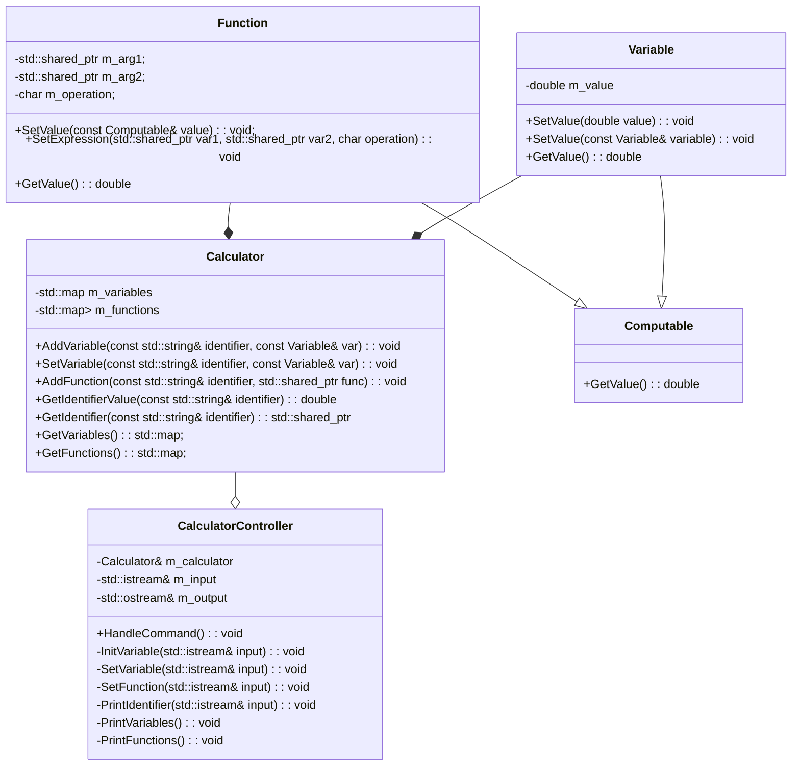

```mermaid
classDiagram
    class CalculatorController {
        -Calculator& m_calculator
        -std::istream& m_input
        -std::ostream& m_output

        +HandleCommand(): void
        -InitVariable(std::istream& input): void
        -SetVariable(std::istream& input): void
        -SetFunction(std::istream& input): void
        -PrintIdentifier(std::istream& input): void
        -PrintVariables(): void
        -PrintFunctions(): void
    }

    class Calculator {
        -std::map<std::string, Variable> m_variables
        -std::map<std::string, std::shared_ptr<Function>> m_functions

        +AddVariable(const std::string& identifier, const Variable& var): void
        +SetVariable(const std::string& identifier, const Variable& var): void
        +AddFunction(const std::string& identifier, std::shared_ptr<Function> func): void
        +GetIdentifierValue(const std::string& identifier): double
        +GetIdentifier(const std::string& identifier): std::shared_ptr<Computable>
        +GetVariables(): std::map<std::string, double>; 
        +GetFunctions(): std::map<std::string, double>; 
    }

    class Computable {
        +GetValue(): double
    }

    class Function {
        -std::shared_ptr<Computable> m_arg1;
        -std::shared_ptr<Computable> m_arg2;
        -char m_operation;

        +SetValue(const Computable& value): void;
        +SetExpression(std::shared_ptr<Computable> var1, std::shared_ptr<Computable> var2, char operation): void
        +GetValue(): double
    }

    class Variable {
        -double m_value

        +SetValue(double value): void
        +SetValue(const Variable& variable): void
        +GetValue(): double
    }


    Function --* Calculator
    Variable --* Calculator

    Function --|> Computable 
    Variable --|> Computable

    Calculator --o CalculatorController

```